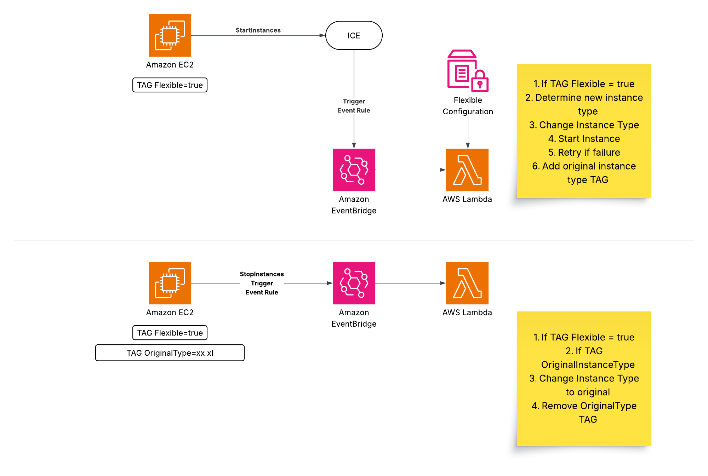

# EC2 Instance Recovery Automation

This CDK project implements an automation solution that handles EC2 instance start failures due to insufficient capacity. When a StartInstances API call fails with "Server.InsufficientInstanceCapacity" error, the automation:

1. Splits multi-instance requests into individual StartInstances calls
2. Attempts to start each instance individually
3. If the start fails again, attempts to modify the instance type to a comparable alternative
4. Retries the start operation with the new instance type

When the instances are stopped, the instance type is reverted to the original one.

Only instances with the Tag flexible=true are managed by this automation.

## Architecture

The solution uses:
- CloudWatch Events Rule to monitor CloudTrail events for StartInstances failures
- Lambda function to handle the recovery logic
- IAM roles and permissions for the recovery Lambda function
- Instance type mapping for finding comparable instance types
- CloudWatch Events Rule to monitor CloudTrail events for StopInstances events
- Lambda function to handle the revert logic upon instance stop event
- IAM roles and permissions for the stop Lambda function



## Prerequisites

- Python 3.9 or later
- AWS CDK CLI
- AWS credentials configured

## Setup

1. Create and activate a virtual environment:
```bash
python -m venv .venv
source .venv/bin/activate  # On Windows: .venv\Scripts\activate
```

2. Install dependencies:
```bash
pip install -r requirements.txt
```

3. Deploy the stack:
```bash
cdk deploy
```

## How it works

### StartInstances workflow
1. The CloudWatch Events Rule monitors CloudTrail for EC2 StartInstances API calls that fail with "Server.InsufficientInstanceCapacity"
2. When a matching event is detected, the Lambda function is triggered
3. The function:
   - Extracts the instance IDs from the failed request
   - Check if the instances are managed by this automation
   - Attempts to start each instance individually
   - If the start fails, looks up comparable instance types
   - Modifies the instance type and retries the start operation
   - Adds a Tag on the EC2 instance with the original instance type
   - Logs all actions and results

### StopInstances workflow
1. The CloudWatch Events Rule monitors CloudTrail for EC2 StopInstances API calls
2. When a matching event is detected, the Lambda function is triggered
3. The function:
   - Extracts the instance IDs from the request
   - Check if the instances are managed by this automation
   - Waits that the instances are fully stopped
   - Revert the instance type to the original one
   - Remoevs the OriginalType Tag on the EC2 instance
   - Logs all actions and results

## Configuration Parameters

Parameters can be configured in `lambda/config.json`:

### `memoryBufferPercentage`
Controls memory allocation flexibility during instance matching. By default, the tool selects instances with memory equal to or greater than the current allocation. This buffer allows selecting instances with slightly less memory, providing more flexibility while maintaining performance requirements.

- **Type:** Integer (percentage)
- **Default:** `5`
- **Example:** With 5% buffer, an 8GB instance could match a 7.6GB target instance

### `cpuManufacturers`
Specifies allowed CPU manufacturers for target instances. Instances with CPUs from unlisted manufacturers will be excluded from selection.

- **Type:** Array of strings
- **Default:** `["intel"]`
- **Valid options:** `"intel"`, `"amd"`, `"amazon-web-services"`, `"apple"`
- **Example:** `["intel", "amd"]` allows both Intel and AMD processors

### `excludedInstanceTypes`
Excludes specific instance families, types, or generations from selection. Supports wildcard patterns using asterisk (`*`) for flexible matching.

- **Type:** Array of strings
- **Default:** `[]` (empty - no exclusions)
- **Wildcard examples:**
  - `"m5.8xlarge"` - Excludes specific instance type
  - `"c5*"` - Excludes entire C5 family (including C5a, C5n)
  - `"m5a.*"` - Excludes all M5a sizes, but allows M5n
  - `"r*"` - Excludes all R-family instances
  - `"*3*"` - Excludes all 3rd generation instances

### `bareMetal`
Controls inclusion of bare metal instance types in the selection process.

- **Type:** String
- **Default:** `"included"`
- **Options:**
  - `"included"` - Include bare metal instances in selection
  - `"required"` - Only consider bare metal instances
  - `"excluded"` - Skip all bare metal instances

---

### Example Configuration

```json
{
    "version": 1,
    "default": {
        "memoryBufferPercentage": 10,
        "cpuManufacturers": ["intel", "amd"],
        "excludedInstanceTypes": ["t2.*", "t3.*", "m4*"],
        "bareMetal": "excluded"
    }
}
```

**Note:** Configuration changes require redeploying the Lambda function to take effect.


## Monitoring

The solution logs all actions to CloudWatch Logs. You can monitor:
- Instance start attempts
- Instance type modifications
- Success/failure of operations

## Cleanup

To remove all resources:
```bash
cdk destroy
```
